# Hi, I'm Antonio 👋

**Software Engineer & MSc student in Computer Science and Engineering @ University of Bologna** — I build geospatial ML systems, IoT sensor networks, and multi-agent architectures, end to end: from embedded C++ on LoRa sensors to causal inference pipelines in Python.

Most of my work is hands-on and full-stack in the broadest sense: real hardware, real data, real deployments — with project management documentation to back it up.

🔭 I'm currently working on **[Adriatic Bloom Risk](https://github.com/antoniorotundo2/adriatic-bloom-risk)**, an operational geospatial system that predicts phytoplankton bloom risk on the Adriatic coast with quantified uncertainty and causal analysis of the Po river influence — published as a preprint ([DOI: 10.5281/zenodo.21204039](https://doi.org/10.5281/zenodo.21204039)).

## 🚀 What I work on

- **Geospatial ML & environmental risk** — probabilistic forecasting, uncertainty quantification, causal analysis
- **AI agent security** — [AgentGuard](https://github.com/antoniorotundo2/agentguard), a continuous Red/Blue/Green security sentinel for AI agents (Kaggle x Google AI Agents Capstone)
- **IoT & sensor networks** — [Chirp Air Station](https://github.com/antoniorotundo2/chirp-air-station), a distributed air-quality network built on LoRa, Wi-Fi and MQTT (C++, Docker, MongoDB, Node.js, React)
- **Multi-agent & multi-paradigm systems** — Prolog-orchestrated logic agents driving real-time 3D simulation in Godot, coordinated by Scala over WebSocket
- **Concurrent & distributed programming** — native Java threads, RxJava, Akka actors, profiling with JProfiler, model checking with TLA+
- **Computer vision & deep learning** — Covid-19 chest X-ray classification (Python, TensorFlow), image classification in .NET with EmguCV/OpenCV
- **Systems, networks & security** — Linux (Gentoo, Fedora), OpenStack, Ansible, containers, GDPR compliance, digital forensics

## 👨‍💻 About me

- 🎓 **MSc in Computer Science and Engineering** at the University of Bologna (thesis in Project Management), after a BSc in Computer and Telecommunications Engineering (thesis on the SPID authentication methodology)
- 🐧 Open source since the beginning: contributed to the **Sabayon Linux** distribution (kernel and system modules) and have been a freelance **beta tester** since 2011
- 🛡️ Former **IT systems analyst** at the University of Molise — network security, access control, GDPR compliance, forensics tooling
- 🌐 Former **web developer & information systems manager** (HTML, JavaScript, PHP, ERP)
- 📜 Certifications: Red Hat technical overviews (OpenStack, Ansible, Containers, Virtualization, RHEL), ECDL — 🇬🇧 English C1/C2
- 💼 Open to roles as **IT Project Manager · Embedded Software Engineer · .NET Developer · Scala Developer · Data Scientist**

## 📌 Featured projects

| Project | What it does | Stack |
|---|---|---|
| [adriatic-bloom-risk](https://github.com/antoniorotundo2/adriatic-bloom-risk) | Geospatial phytoplankton bloom risk prediction with quantified uncertainty and causal analysis | Python, ML, geospatial |
| [agentguard](https://github.com/antoniorotundo2/agentguard) | Continuous Red/Blue/Green security sentinel for AI agents | Python, AI agents |
| [chirp-air-station](https://github.com/antoniorotundo2/chirp-air-station) | Distributed air-quality sensor network over LoRa / Wi-Fi / MQTT | C++, Node.js, React, Docker, MongoDB |
| [cas-sensor-lora](https://github.com/antoniorotundo2/cas-sensor-lora) · [cas-sensor-gateway](https://github.com/antoniorotundo2/cas-sensor-gateway) · [cas-mqtt-service](https://github.com/antoniorotundo2/cas-mqtt-service) · [cas-web-service](https://github.com/antoniorotundo2/cas-web-service) | Chirp Air Station microservice components, from firmware to web UI | C++, JavaScript |
| [portfolio](https://github.com/antoniorotundo2/portfolio) | Personal portfolio website | Scala |

## 🛠️ Tech stack

## 📊 GitHub stats

<!-- SVGs generated daily by .github/workflows/grs.yml and committed to profile/ -->

## 📫 Get in touch

- 💼 LinkedIn: [in/eng-antoniorotundo](https://www.linkedin.com/in/eng-antoniorotundo)
- 🌐 Portfolio: [portfolio-fh9p.onrender.com](https://portfolio-fh9p.onrender.com)

**🌱 Building something at the intersection of geospatial data, IoT, or AI agents? I'd love to chat.**
